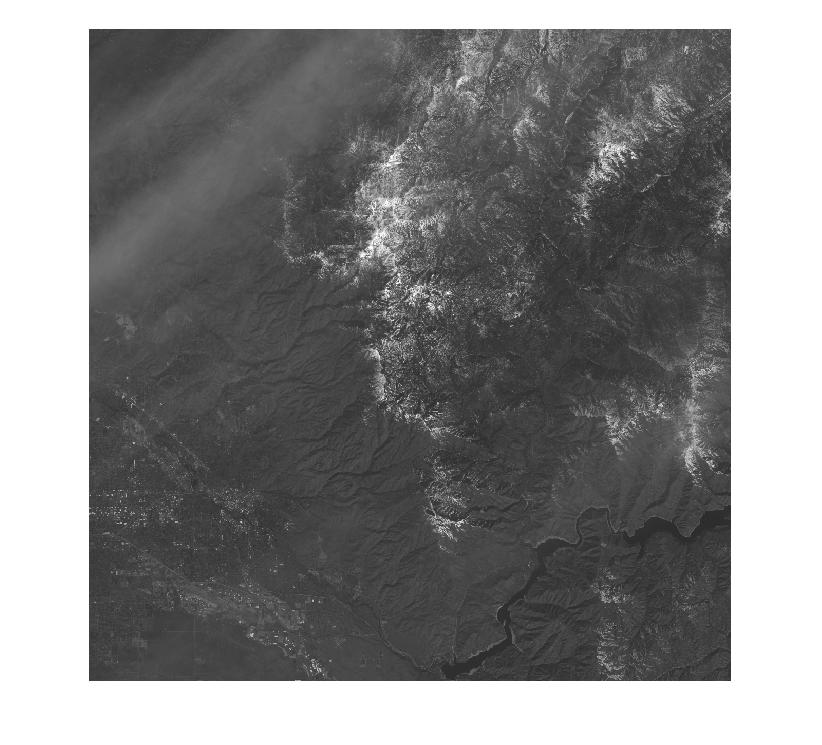
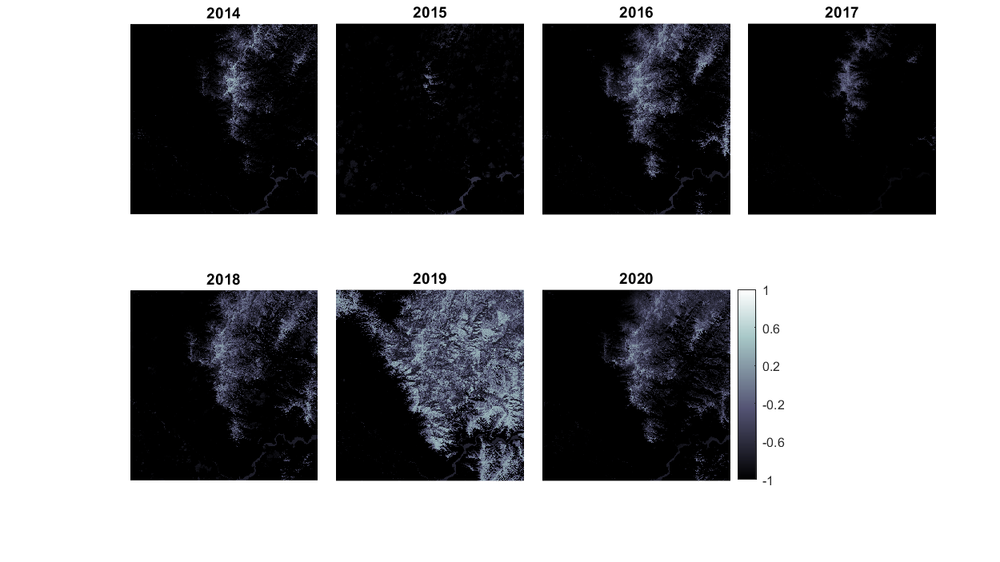
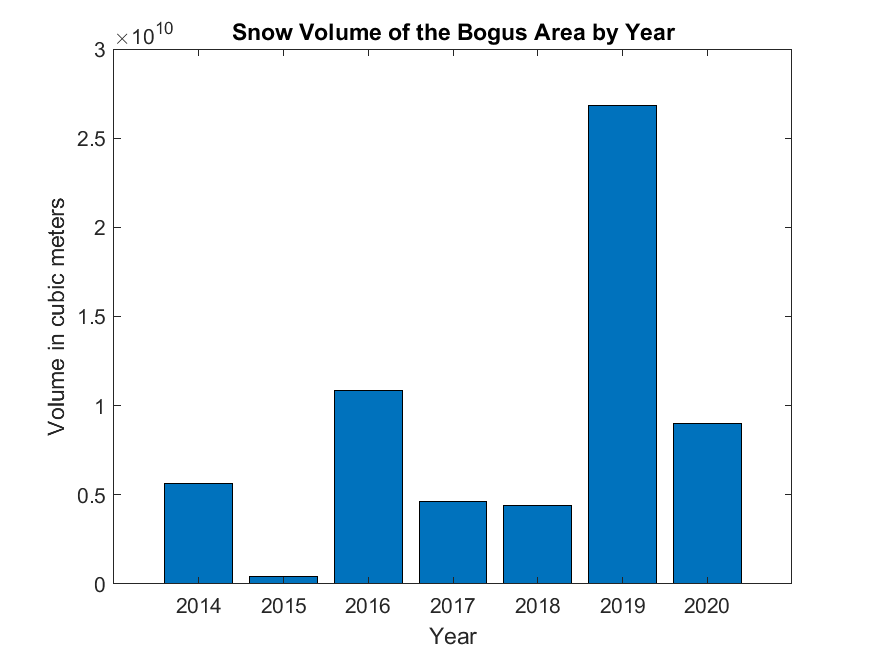

# Calculating Snow Volume Change of the Bogus Basin Area
## Figure 1: Site Area

This figure shows the location where the snow volume was calculated. 
## Figure 2: NDSI Change from 2014 to 2020

This figure shows the NDSI values across the Bogus Basin area calculated from Landsat 8 images. 
## Figure 3: Snow Volume Change

Using the NDSI values greater than 0.4, an area was determined and multiplied by the snow depth recorded from the Bogus Basin SNOTEL site in order to calculate snow volume. 
